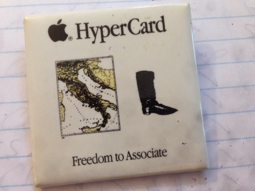

Every so often, [HyperCard](https://en.wikipedia.org/wiki/HyperCard) pops up again in one of my feeds.

HyperCard disappeared not long before the World Wide Web rose to dominance but is still not forgotten. What exactly was it that captured the imagination of so many?

Perhaps it was the idea that everyone could be both a reader and also an author, using the same tools. HTML's "View Source" with all its flaws was at least an echo of this freedom. The "modern web" has nearly eliminated this entirely.

But many ideas that [Bill Atkinson](https://en.wikipedia.org/wiki/Bill_Atkinson) and [Dan Winkler](https://en.wikipedia.org/wiki/HyperTalk) put into motion during those glory days of the five-colored Apple still live on, and may yet return some day.
